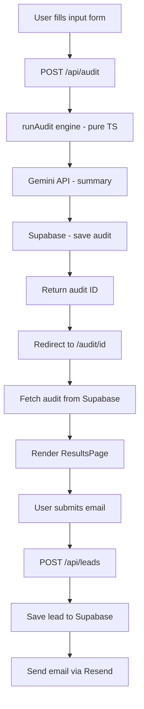

# Architecture

## System Diagram

## Data Flow
1. User inputs tools + plans + spend on homepage
2. Form POSTs AuditInput to /api/audit
3. Server runs pure deterministic audit engine (no AI)
4. Gemini generates a 100-word narrative summary (with fallback)
5. Result saved to Supabase with a nanoid public ID
6. User redirected to /audit/[id] — shareable URL
7. Page rendered server-side with OG metadata for link previews
8. User optionally submits email → saved as lead → confirmation email sent

## Stack
- **Frontend:** Next.js 14 App Router, TypeScript, Tailwind CSS, shadcn/ui
- **Backend:** Next.js API Routes (serverless functions on Vercel)
- **Database:** Supabase (Postgres)
- **AI:** Gemini 1.5 Flash (summary only)
- **Email:** Resend
- **Deploy:** Vercel

## Scaling to 10k audits/day
- Move rate limiting from in-memory Map to Upstash Redis (survives restarts)
- Add Supabase connection pooling via PgBouncer
- Cache audit results at CDN edge for shareable URLs
- Add a queue (Inngest or Trigger.dev) for email sending
