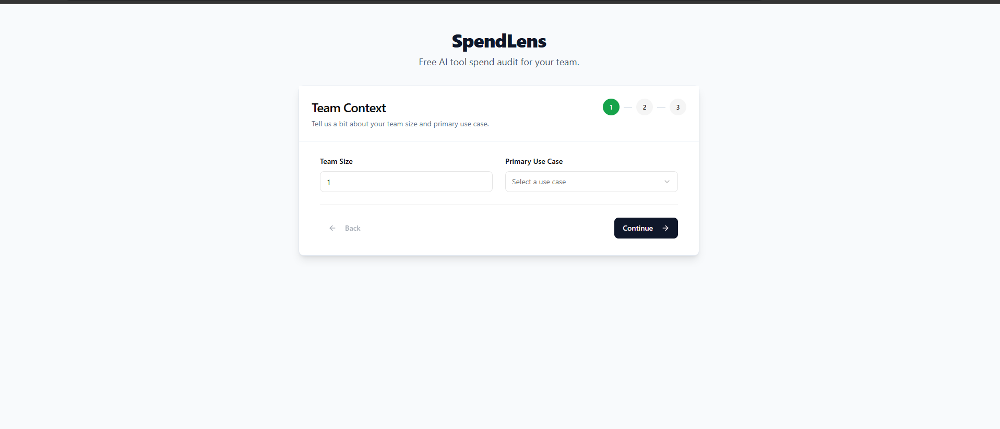
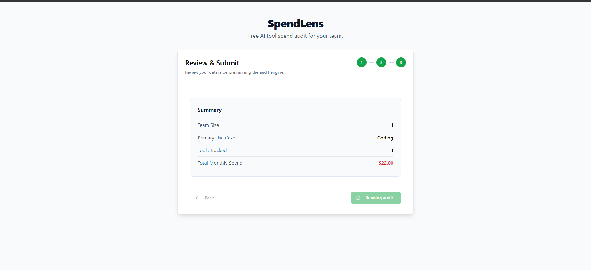
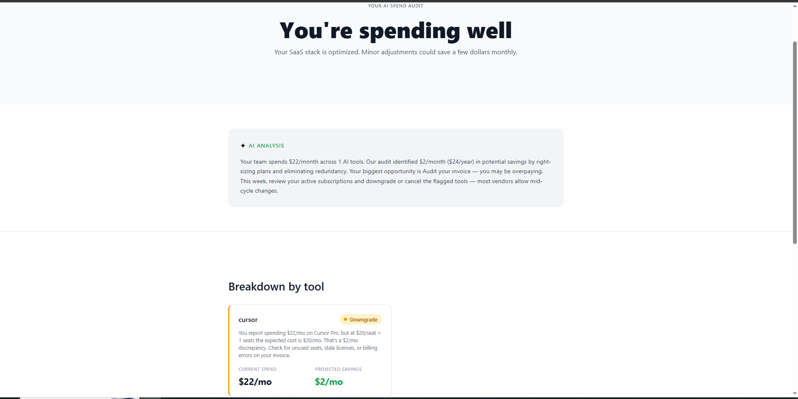

# SpendLens — AI Spend Audit Tool

SpendLens is a free web app for startup founders and engineering managers 
to audit their AI tool spending, identify overspend, and get actionable 
recommendations. Built as a lead-generation asset for Credex, which sells 
discounted AI infrastructure credits.

**Live:** https://credex-kappa-one.vercel.app/

## Screenshots

### Input Form


### Auditing


### Audit Results


## Quick Start
```bash
git clone [repo]
cd spendlens
npm install
cp .env.local.example .env.local
# Fill in env vars
npm run dev
```

## Deploy
Deployed to Vercel.

## Decisions
1. **Next.js App Router over Pages Router** — Server components let us fetch 
   audit data server-side for OG metadata generation without client waterfalls.
2. **Hardcoded audit rules over AI** — The audit math uses deterministic rules 
   so results are auditable and defensible. AI is only used for the summary narrative.
3. **Gemini over Anthropic API** — Gemini 1.5 Flash has a genuinely free tier; 
   Anthropic requires paid credits. For a free tool, zero marginal cost per audit matters.
4. **Supabase over raw Postgres** — Built-in auth, instant REST API, and a generous 
   free tier made it faster to ship than provisioning our own DB on Render.
5. **nanoid for audit IDs over UUIDs** — Shorter, URL-safe, still collision-resistant 
   at our scale. Makes shareable URLs cleaner.
